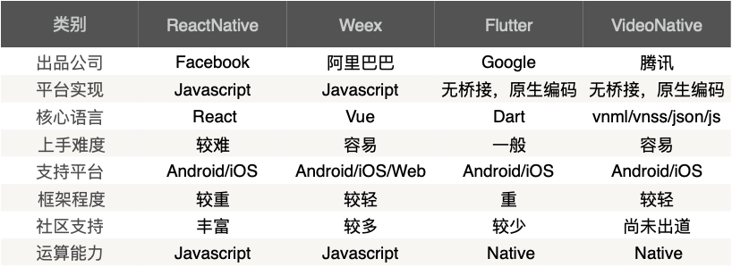
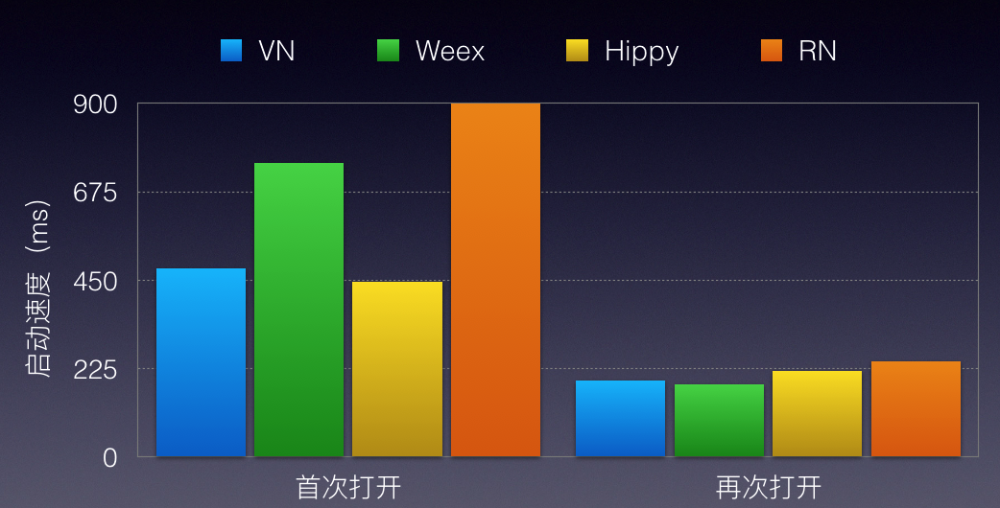
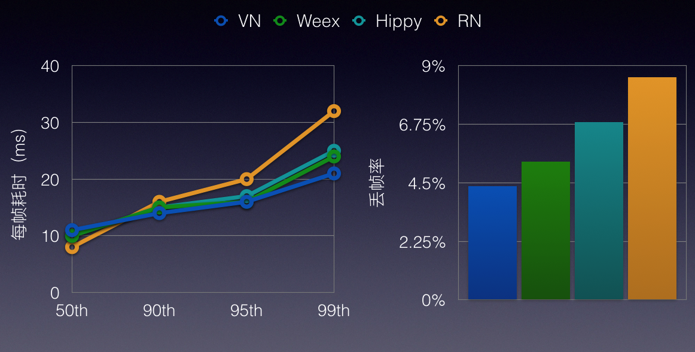
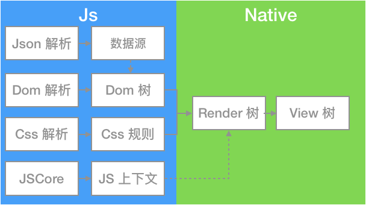
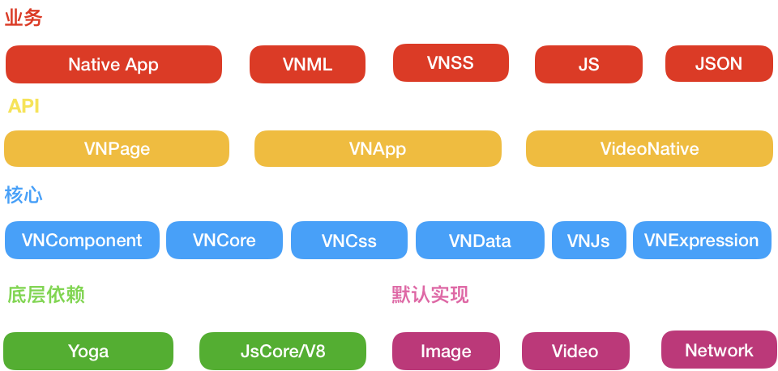
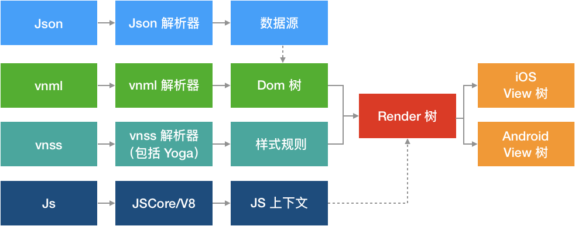
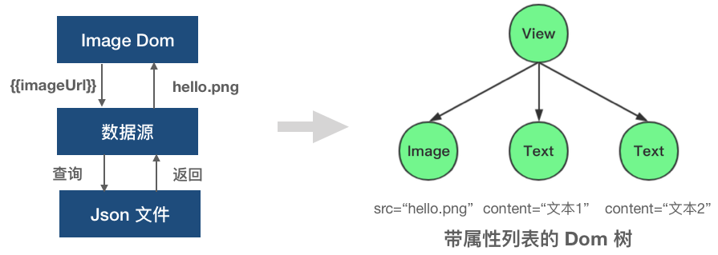

# 高性能的移动跨平台开发框架——VideoNative

[TOC]

## 零、写在前面
> 
VideoNative 是腾讯视频团队完全自研的一套高性能，跨平台的移动端跨平台开发框架。该框架从移动端开发者的角度出发，在设计上规避了 Weex/ReactNative 等框架的性能瓶颈，因此拥有更高的性能表现。目前已有腾讯视频多个常用业务接入，包括亿级日活的个人中心业务；整个腾讯视频国际版 App 的所有业务均使用 VideoNative 框架进行开发

[VideoNative 开发者文档](https://videonative.github.io/VideoNative)

iOS 的 Demo


Android 的  Demo
    


## 一、现阶段的移动端跨平台开发框架
腾讯视频是一款运营驱动的产品，App 内活动众多，经常需要动态更改页面内容来满足运营需求；而当前的版本迭代速度快，加上审核速度慢；再者人力也不足。这些因素驱动我们内部的技术团队开发了一套移动端跨平台开发框架——__VideoNative__

在正式介绍 VideoNative 框架之前，我们先看看现有的主流移动跨平台开发框架有哪些

主要有 ReactNative、Weex 和 Flutter，下图是它们和  VideoNative 的简单对比



除了这些，还有公司内部的 Hippy，是类似 ReactNative 但比其性能更优的框架

## 二、Why VideoNative

跨平台框架琳琅满目，为什么选择 VideoNative 呢？一言以蔽之，__性能更优__

我们先看下性能对比的数据

### 1. 性能对比
我们写了一个 Demo，分别对 VideoNative、Weex、ReactNative 和 Hippy 进行测试（由于 Flutter 刚出道，所以没在测试之列，后续再补充）

其中 RN 版本为`0.55.4`，Weex 版本为`0.18.0`，Hippy 版本为`2018.10.15`

测试的指标包括以下几个方面：启动速度；内存消耗；CPU 使用率和流畅度


	
+ 启动速度包括首次页面加载时间和二次页面加载时间：执行10次取均值

	
	
	可以看到首次页面加载时，VideoNative 和 Hippy 更快

+ 内存：执行10次取均值

	
	
	可以看到，VideoNative 的内存占用是最低的

+ CPU：列表界面滑动30秒，取 CPU 占用平均值

	
	
	可以看到除了 ReactNative CPU 占用较高，其他框架的占用率不相上下

+ 流畅度：列表上下反复滑动60秒

	
	
	可以看到 VideoNative、Weex 和 Hippy 大部分的帧均保持了较低的耗时（横坐标是帧的百分比）；同时 VideoNative 保持了较低的丢帧率

总体而言，相对于其他框架，VideoNative 在性能上表现上是占优的，为什么 VideoNative 能够有更好的性能呢，我们可以简单看下其和 Weex 的原理对比

### 2. 渲染原理对比
无论是 Weex、ReactNative 还是 VideoNative，其渲染流程都不可避免地要处理数据、Dom、样式和 Js 的解析过程。VideoNative 与 Weex 等差别最大的地方在于，Weex 将这些解析过程都放到 Js 侧去执行；而 VideoNative 则是尽可能的将这些解析过程放在 Native 侧去做，包括数据的解析和绑定、Dom 的展开、Css 的解析和匹配，Js 在 VideoNative 中只负责事件监听和业务逻辑，而这一部分是不可避免必须依赖 Js，这就使得 VideoNative 对 Js 的依赖减少到最小（假如业务只需要一个静态页面，不涉及事件监听和业务逻辑，那么 VideoNative 完全可以做到渲染页面的时候不调用 Js 库，而 Weex 做不到）

Weex 的渲染原理如下图



VideoNative 的渲染原理如下图


将更多的处理逻辑放在 Native 侧的好处如下：

+ 相同的计算量下，Native 的执行效率和运算能力要强于 Js
+ 大量数据发生变更的时候，Weex 可能需要进行多次 Js 和 Native 的交互，导致性能低下，因为 Weex 的 Dom 树和数据都是在 Js 侧维护，每次数据变更的时候，需要将这个变更从 Js 通知到 Native 完成 UI 更新（这个也是 Weex 设计 `recycle-list` 代替 `list` 的原因之一）。而 VideoNative 的 Dom 树和数据都是在 Native 侧维护，所以没有多余的 Js 和 Native 交互
+ Native 的优化空间更大
    + 可以利用 Native 的多线程能力进行 Dom 树构建、表达式计算、Css 匹配规则的计算、Yoga 布局
    + Dom 树和样式的解析都是耗时操作，我们可以将 Dom 树和样式的解析的中间结果序列化到本地，下次打开页面再反序列化到内存，直接省略树的展开、计算属性等步骤。这样会节省很多时间


## 三、VideoNative 原理简述
### 1. 架构图


#### 业务层
VideoNative 的业务使用 vnml/vnss/js/json 进行开发，想了解更多业务开发相关可以参照[开发文档](https://videonative.github.io/VideoNative)

Native 层负责提供 VideoNative 需要的数据（比如下载离线包、解压缩等，框架无需关心数据的来源），决定 VideoNative 页面的粒度、注入 JSApi、注册 Native 组件等。

#### API 层
API 层主要提供 VNApp 和 VNPage 两个不同的接口让 Native 开发者决定 VideoNative 页面的粒度大小，既可以使用 VNApp 来实现整个 Controller/Activity 使用框架来渲染，也可以使用 VNPage 只渲染单个 View

+ VNPage 是业务开发的基本单位，每个 Page 由 vnml/vnss/js/json 来描述。VNPage 暴露接口可以让 Native 开发者直接获取框架渲染成功后的 View；注册该页面特有的 JSApi，设置该页面的安全区等等。使用 VNPage 的特点是灵活，Native 开发者可以方便的将框架渲染后的 View 添加到指定位置

+ VNApp 是一组 VideoNative 页面构成的集合，拥有 AppId 等属性，每个 VNApp 的存储空间是相互隔离的（可以类比下小程序），VNApp 提供直接进入指定 VideoNative 页面，以及获取指定某个单页面的能力。VNApp 的特点是可以做到业务隔离，同时相比 VNPage，可以更方便地实现多个页面之间共享数据，简化页面之间的跳转逻辑

+ VideoNative 是一个单例类，主要提供获取 VNApp 和 VNPage 的接口，以及提供全局 JSApi 、以及 Native 组件的注册

#### 核心层
VideoNative 核心层主要包括 VNComponent、VNCore、VNCss、VNData、VNExpression 等模块，其中

+ VNCss 主要负责样式的解析和渲染，样式的解析依赖了 Yoga

+ VNData 负责处理 Json 数据

+ VNJs 负责处理事件响应和业务逻辑

+ VNExpression 是表达式模块，负责解析脚本里的胡子语法中的表达式计算；

	>
	什么是胡子语法（Mustache）？Mustache 是一个 logic-less（轻逻辑）模板解析引擎，它是为了使用户界面与业务数据（内容）分离而产生的。比如 vnml 中的代码：{{userInfo.nickName}}，这里的{{ }}就是 Mustache 的语法。
	
+ VNCore 负责调度 VNCss、VNData、VNJs 等其他模块，将数据、样式、JS 逻辑应用到 UI 结构上

+ VNComponent 是组件层，封装了业务开发中常用的控件，比如图片、文本、列表，更多控件的细节可查阅[文档](https://videonative.github.io/VideoNative/#/Controls)


#### 底层依赖
+ [Yoga](https://github.com/Facebook/Yoga) 是由 C 实现的布局引擎，是 FaceBook 团队对 [Flexbox](https://www.w3.org/TR/css-flexbox-1/) 的跨平台实现

	> Flex 是W3C提出了一种新的布局方案，可以简便、完整、响应式地实现各种页面布局。

+ Js 在整个 VideoNative 框架中扮演的是处理事件响应和业务逻辑的角色，我们在 iOS 上使用了系统的 JavaScriptCore 框架来出处理，而 Android 上则使用 Google 开源的 [V8 引擎](https://github.com/v8/v8)

#### 默认实现
为了保持框架的通用性，VideoNative 内置的原生模块有限，包括图片库、网络库、播放器、JCE 等默认实现，不过 VideoNative 提供了横向扩展的能力，可以扩展原生模块，支持替换这些默认实现

整个框架采用依赖注入的方式，遵循了控制反转的设计模式，实现了框架与外部解耦

### 2. 渲染流程
描述一个 VideoNative 的页面涉及4个文件：vnml、vnss、json 和 js

下图是整个渲染流程，整个渲染流程的本质就是将左边的这4个文件渲染成最右边的 View 树



其中 

+ json 解析出来叫数据源
+ vnml 解析出来叫 Dom 树；Dom 树是反应代码结构的树
+ Dom 树解析的时候，依赖数据源 ，将数据绑定到 Dom 上
+ vnss 解析出来叫样式规则
+ 数据+样式+UI 结构，合起来我们可以构造一颗渲染树，渲染树是与 View 树一一对应的，反应了真实的视图结构
+ View 树是 iOS/Android 系统上的原生 View 构成的层级关系

以构建下图的 UI 为例，主要包括一张图片和两行文本，代码和流程如下


vnml 文件

```html
<view id="root">
    <image src="{{imgUrl}}"/>
    <text>{{text1}}</text>
    <text>{{text2}}</text>
</view>
```

vnss 文件

```css
#root {
    width:100%;
    height:100%;
}
```

json 文件

```json
{
  "imgUrl": "hello.png",
  "text":"文本1", 
  "text2":"文本2"
}
```

js 文件

```js
page({
    onReady:function () {
      console.log("Hello"); // 页面 Ready 的回调里输出 Hello
    }
});
```

#### 第一步：构建 Dom 树


源码主要是一个  View 标签，里面有一个 image 标签和两个 text 标签

源码经过解析器生成了右图的 Dom 树，但此时 Dom 树还没有属性

#### 第二步：将 Dom 树上的属性解析出来


image 标签上 ImageUrl 的表达式，Image Dom 将表达式扔到数据源中查询，返回 hello.png，从而得到右边的带属性列表的 Dom 树

#### 第三步：构建渲染树


宽高100%的 vnss，经过解析和 Yoga 计算，最终得到具体的位置和大小

在  Dom 树的基础上加上样式规则的结果，我们可以得到一颗渲染树，可以看到根节点的宽高已经被计算出来了

#### 第四步：构建 View 树


我们得到渲染树之后，根据渲染树的结构、数据、样式，绘制出一颗 View 树，也就是真正的页面，有正确的大小，文本和图片内容

## 四、未来计划
+ 更加易用的集成开发环境
+ 更丰富的组件库（TabBar、ProgressBar、Picker、Canvas）
+ 更健全的 API（Toast、Dialog）
+ 框架性能优化（CSS 属性应用流程多线程化、JS与Native数据穿透的性能优化）
+ 在线访问页面的能力
+ 更多…


## 五、加入我们
### 谁在使用 VideoNative
腾讯视频目前已经使用 VideoNative 接入多个业务，其中包括日活过亿的个人中心页面。腾讯视频国际版整体业务使用 VideoNative 开发，目前已经顺利在海外上线。

+ 腾讯视频国际版

    
+ 腾讯视频个人中心
 
    
+ 腾讯视频电视助手
   
    
+ 腾讯视频订阅号页面
  
    

